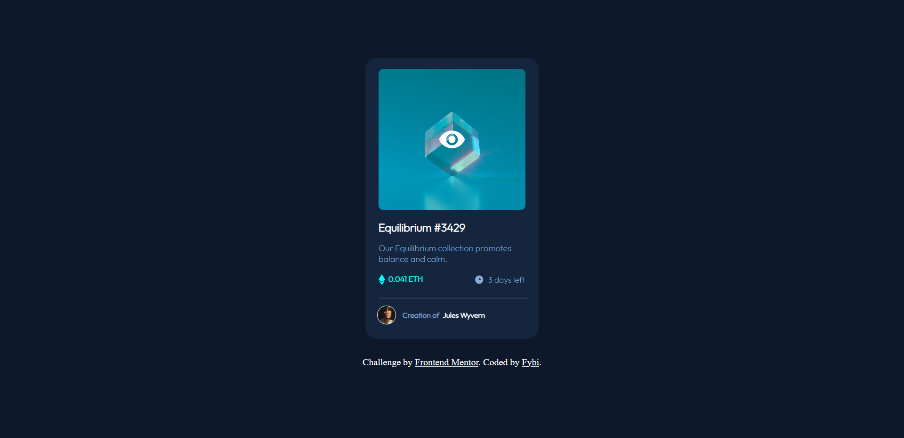

# Frontend Mentor - NFT preview card component solution

This is a solution to the [NFT preview card component challenge on Frontend Mentor](https://www.frontendmentor.io/challenges/nft-preview-card-component-SbdUL_w0U). Frontend Mentor challenges help you improve your coding skills by building realistic projects. 

## Table of contents

- [Overview](#overview)
  - [Screenshot](#screenshot)
  - [Links](#links)
- [My process](#my-process)
  - [Built with](#built-with)
  - [What I learned](#what-i-learned)
- [Author](#author)
- [Acknowledgments](#acknowledgments)

**Note: Delete this note and update the table of contents based on what sections you keep.**

## Overview
Recreating an NFT Preview Card Component; a challenge provided by Frontend Mentor. 

### Screenshot

### Links

- Solution URL: 
- Live Site URL: 

## My process

I started by breaking down the project into components, then giving each one a class or an id with HTML. Then I moved on the CSS, styling each class from the top to the bottom. There were a few times I had to go back to an element at the top to modify something, but generally, I followed the top-to-bottom process. 

### Built with

- Semantic HTML5 markup
- CSS custom properties
- Flexbox
- CSS Grid

### What I learned

A new thing I learned with this challenge was how to add images to a page using CSS. I thought that could only be done with HTML, but I realized it could also be done with CSS and used for flexible purposes. 

## Author

- Linktree - [Ameer "Fybi"](https://linktr.ee/chieffybi)
- Frontend Mentor - [@fybi](https://www.frontendmentor.io/profile/fybi)
- Twitter - [@0xFybi](https://www.twitter.com/0xFybi)

## Acknowledgments

Thanks to the moderators in the Frontend Mentor's Discord Community, who helped me figure out the little problems I came across.
